# Belady-s-anomaly

## Why I did this
In OS course, I learned that FIFO suffers Belady's anomaly, while LRU doesn't.
But how about counting algorithms? Like LFU(Least-Frequently-Used) algorithm?
As a result, I decided to run an experiment by myself.
Also, I implemented FIFO as reference.

## Notes
There are two decision I made for implementation of LFU:
1. When deleting least-frequently used page, does the counting of that page need to be preserved? Or the frequency return to zero? 
當要把最不常遇到的 page 刪掉時，他的次數要歸零嗎？
Decision I made: return to zero.

2. When there are several page with same frequency, which page is going to be deleted?
當遇到 page frequency 一樣大時，如何決定刪哪個 page?
Decision I made: smallest page number.

I'm not sure if these decision are right or not.

## Result
### reference string: 1,2,3,4,1,2,5,1,2,3,4,5

FIFO

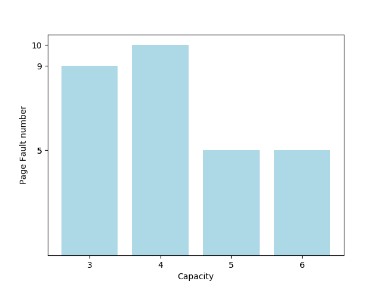

LFU

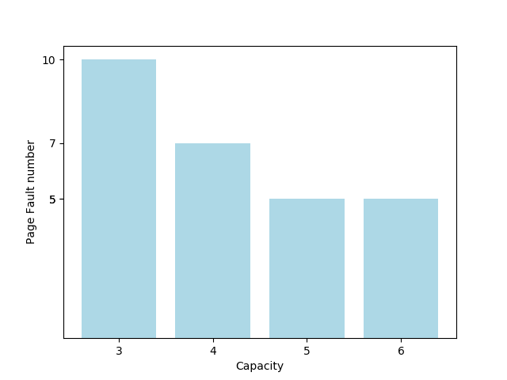

### reference string: 1,3,4,7,1,8,9,7,6,2,8,0

FIFO

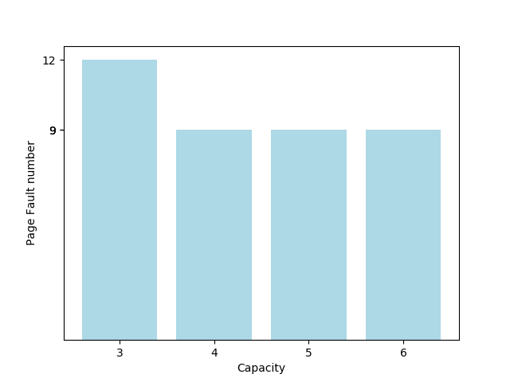

LFU

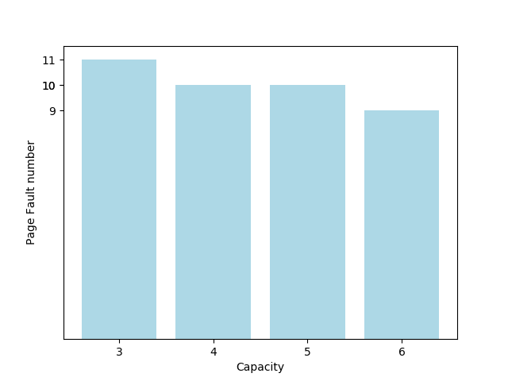

### reference string: 2,4,1,5,1,0,7,3,1

FIFO:

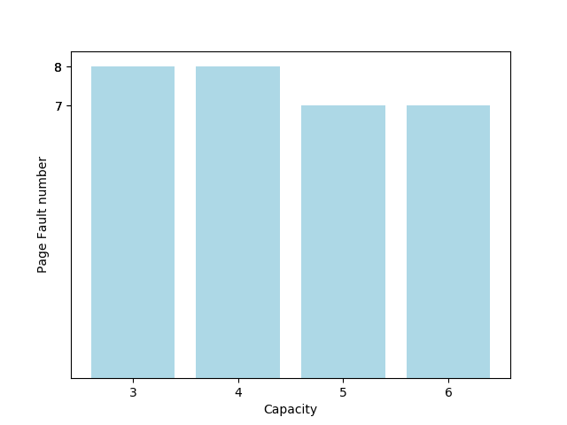

LFU:

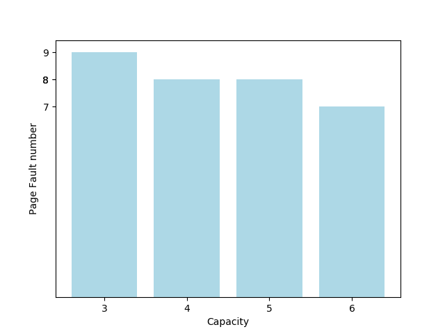

### reference string: 3,4,2,5,2,6,3,8,7,0,2,4,0,7,4

FIFO:

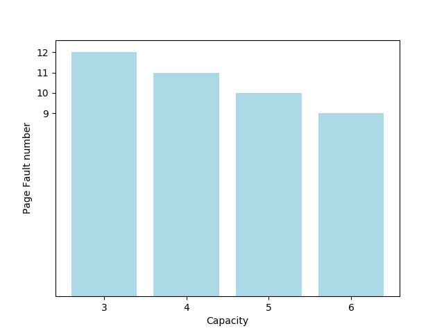

LFU:

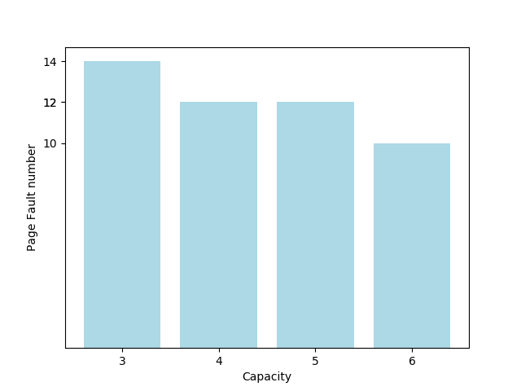

### reference string: 2,3,4,3,2,4,3,2,4,5,6,7,5,6,7,4,5,6,7,2,1

FIFO:

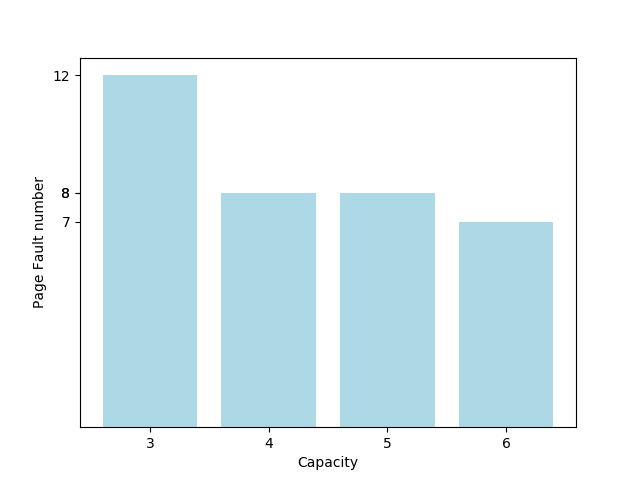

LFU:

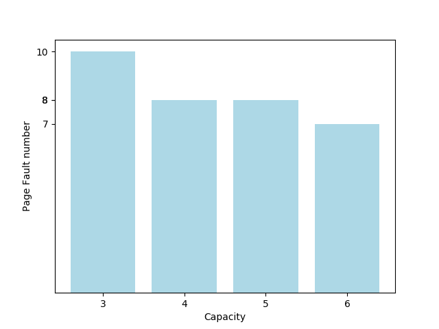

### reference string: 1,2,3,4,5,3,4,1,6,7,8,7,8,9,7,8,9,5,4,5,4,2

FIFO:

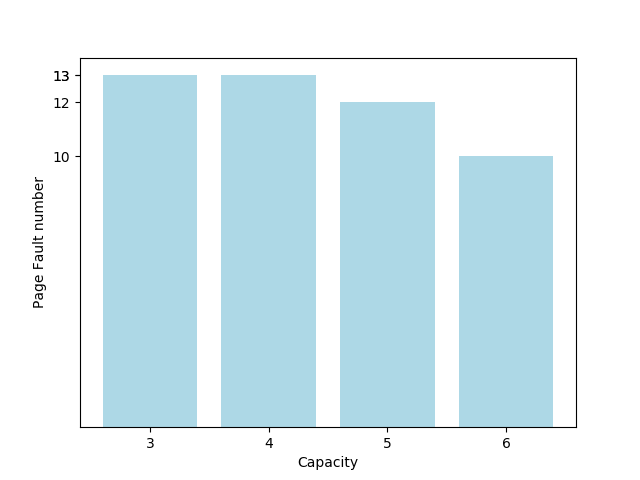

LFU:

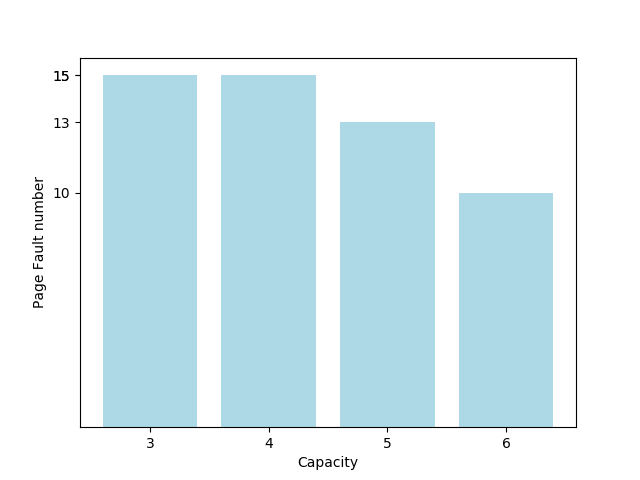

## Conclusion
I don't see the Belady's anomaly happends when using LFU for these reference strings, but will it happends for other reference string? Maybe a more solid proof is needed to know...

## TODO
- [ ] Implement LRU.
- [ ] Combine the charts.

## Reference
reference strings are used from here: 
https://www.iasj.net/iasj?func=fulltext&aId=50712 